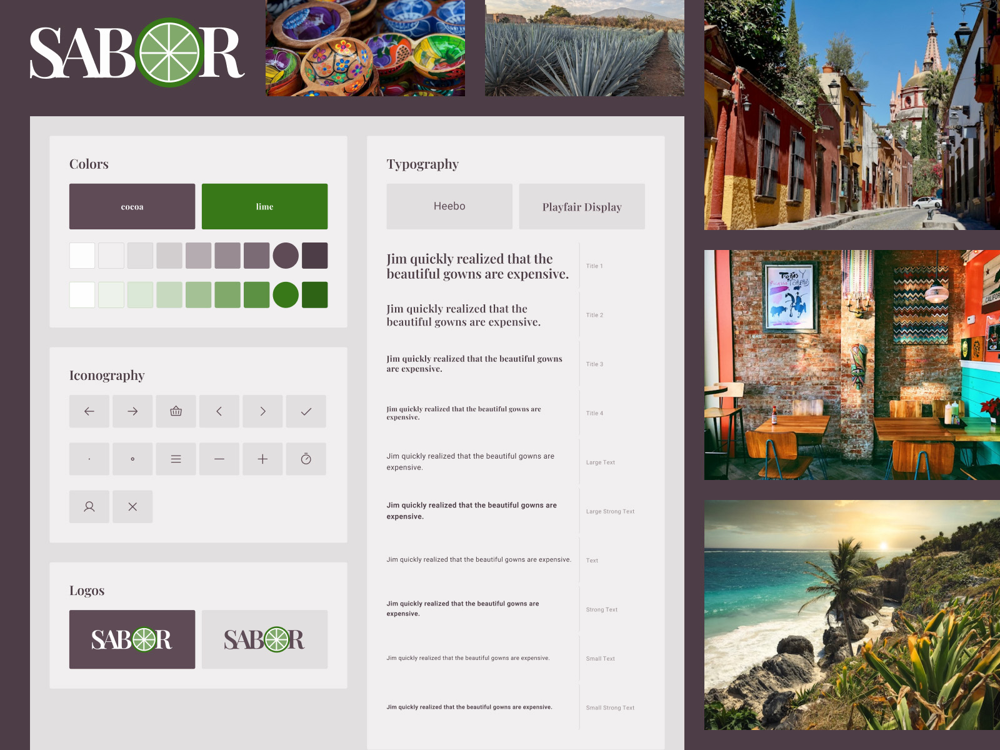

# Sabor Design System

Inspired by the vibrant colors, flavors, and culture of Mexico, Sabor Design System combines authenticity with intuitive functionality. From visually captivating interfaces to seamless navigation, every aspect is meticulously designed to enhance user engagement and satisfaction.

---


## Demo

[sabor-design-system.netlify.app](https://sabor-design-system.netlify.app)

---


## Development

Run the following to start a local development server:

```bash
npm install
npm start
```

Note: This project was created with node 20.11.0 and npm 10.4.0.

---


## Additional Documentation

### Project History

This project was created using Vite (React/TypeScript):

```bash
npm create vite@latest .
npm install
```

The following dependencies were added:

```bash
npm install --save-dev react-router-dom sass
npm install @phosphor-icons/react
```
